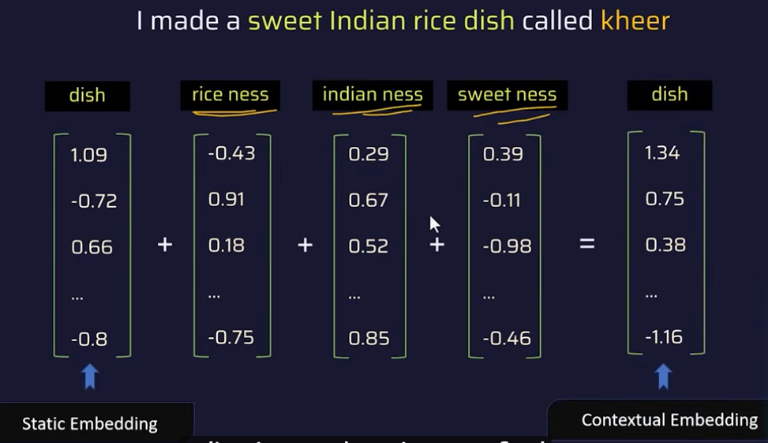
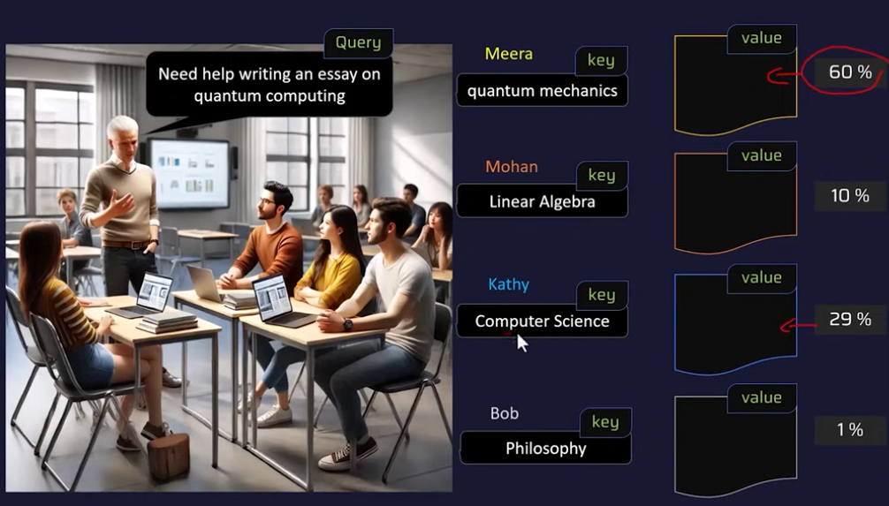
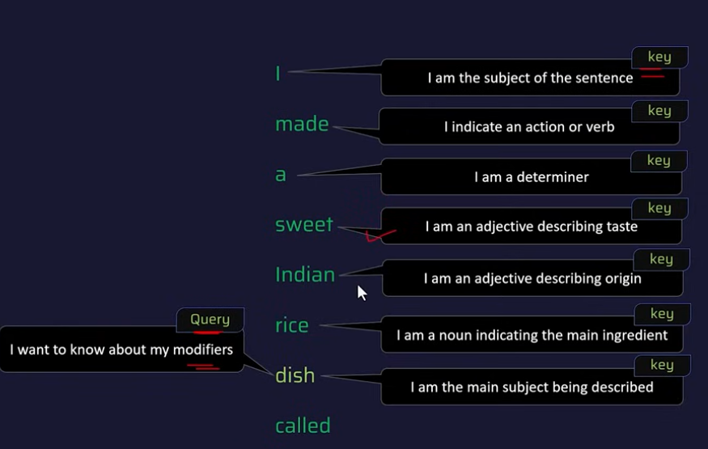
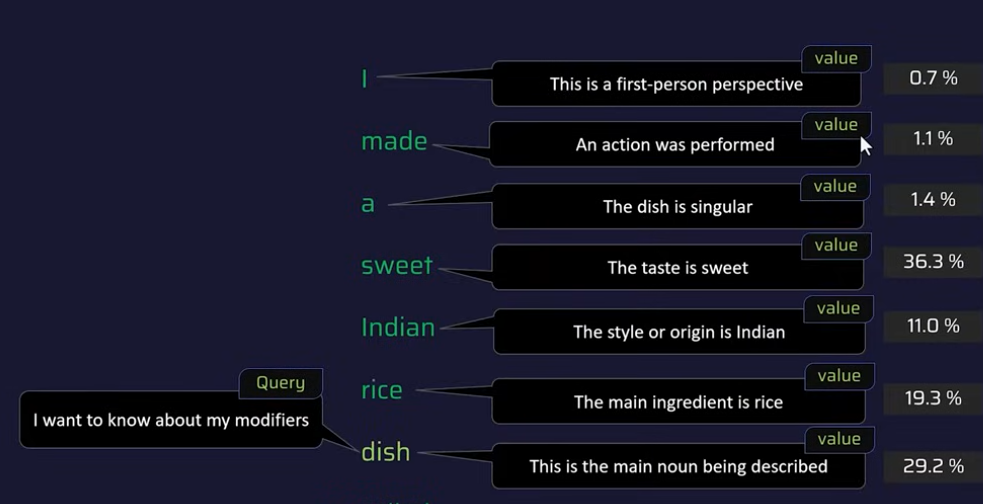
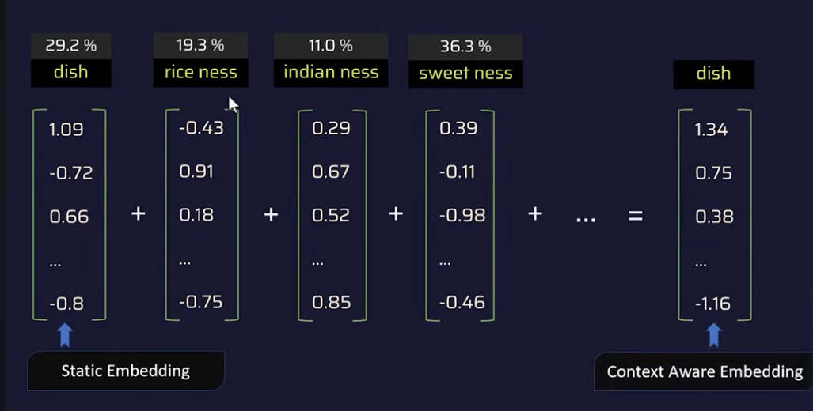
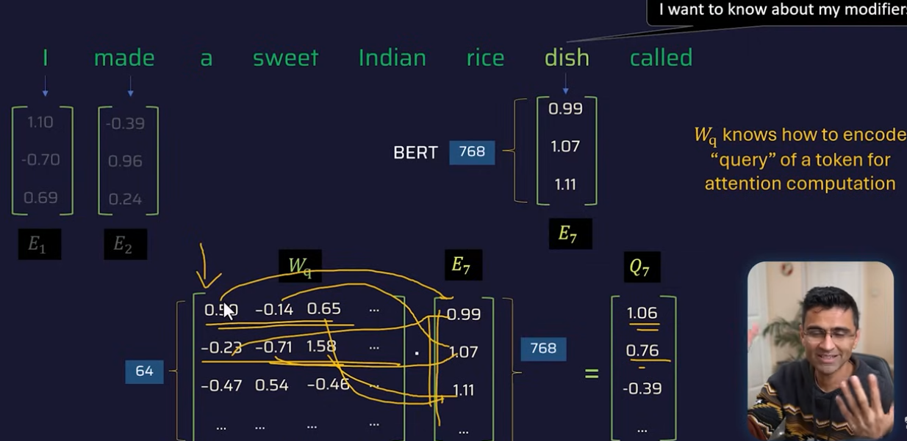
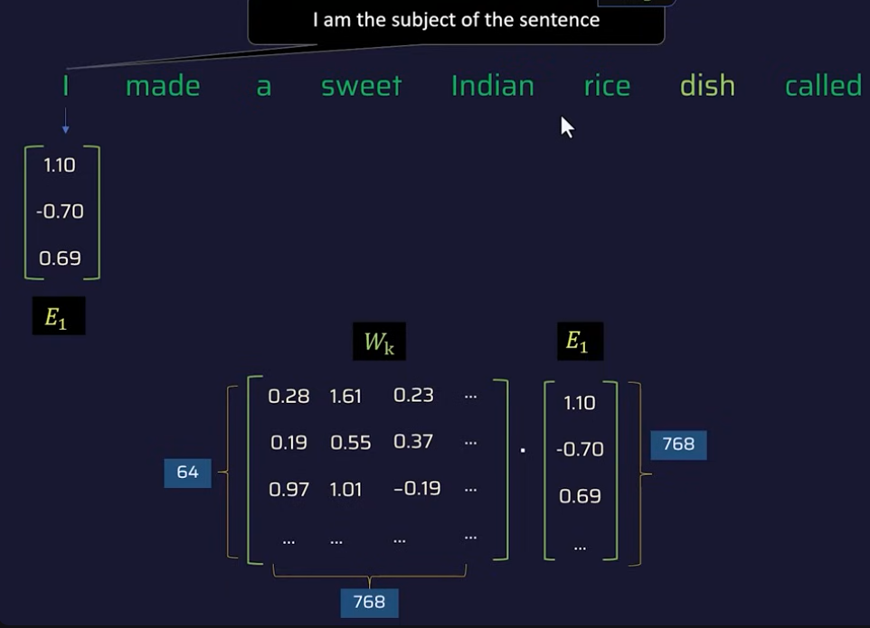
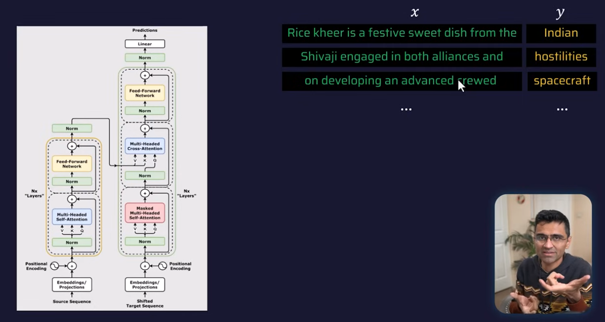

**Concept overview**

One big comparative diagram

Separate Mermaid diagrams for each integration type (you can directly paste into docs / slides / Dify notes)

1. Dify integration types – mental model

Dify app can be exposed in 3 major ways:

API Integration

Your system talks to Dify via REST (/chat-messages, /completion-messages, etc.).

You own the UI, auth, session, etc.

Public URL Integration

Dify hosts the chat UI on a shareable URL.

You just link or redirect users to it (e.g., from intranet, portal, email).

Embedded Integration

You embed Dify’s chat widget / iframe inside your site or web app.

Looks native to your app but runs from Dify behind the scenes.

2. High-level comparative diagram
flowchart LR
    subgraph ClientApps[Client Applications]
        A1[Web / Mobile App Custom UI]
        A2[Intranet / Portal Link Button]
        A3[Existing Website Embedded Widget]
    end

    subgraph DifyExposure[Dify Exposure Modes]
        API[REST API /chat-messages, /completion-messages]
        URL[Public/Private URL (Hosted Chat UI)]
        EMB[Embed Widget iframe / script]
    end

    subgraph DifyCore[Dify Platform]
        APP[App Definition (Prompts, Workflow, Tools, Datasets)]
        ORCH[Orchestrator Workflow / Agent Engine]
        LLM[LLM Providers OpenAI / Anthropic / Ollama...]
        KB[Datasets / RAG]
    end

    A1 -->|HTTP calls| API
    A2 -->|Open link| URL
    A3 -->|Embedded iframe/script| EMB

    API --> APP
    URL --> APP
    EMB --> APP

    APP --> ORCH
    ORCH --> LLM
    ORCH --> KB

3. Pattern 1 – API integration
Use case

Microservice → Dify

Frontend React/Angular → own UI, call Dify as AI backend

Banking / RM tools / CRM panels

Sequence: Client ↔ Dify ↔ LLM
sequenceDiagram
    autonumber
    participant FE as Your Frontend / Backend
    participant DAPI as Dify API
    participant APP as Dify App Orchestrator
    participant WF as Workflow / Agent Engine
    participant LLM as LLM Provider
    participant KB as RAG / Datasets

    FE->>DAPI: POST /v1/chat-messages\n(app_key, user, query, inputs)
    DAPI->>APP: Validate key & load app config
    APP->>WF: Start workflow (nodes, tools, datasets)

    alt Workflow uses datasets
        WF->>KB: Query RAG (embed + vector search)
        KB-->>WF: Top-k context chunks
    end

    WF->>LLM: Prompt with context (sys + user + tools + RAG)
    LLM-->>WF: Streaming tokens
    WF-->>DAPI: Final answer / streaming
    DAPI-->>FE: SSE / JSON response

Integration block diagram
flowchart LR
    subgraph YourSystem[Your System]
        FE[Front-end UI React / Angular / Mobile]
        BE[Backend Services Java / Python / Node]
    end

    subgraph Dify[Dify Platform]
        API[Public REST API Auth + Routing]
        APP[App Config Prompts / Workflows / Tools]
        WF[Workflow / Agent Engine]
        KB[Datasets / RAG]
        LLM[LLM Providers]
    end

    FE -->|REST / HTTPS| BE
    BE -->|REST / HTTPS| API
    API --> APP
    APP --> WF
    WF --> KB
    WF --> LLM
    WF --> API
    API --> BE
    BE --> FE

4. Pattern 2 – Public URL integration
Use case

Fast PoC, internal demo

You send a Dify-hosted chat URL to RMs, ops team, etc.

No code or minimal code: just a link.

Flow diagram
flowchart LR
    U[End User (Browser)]
    BTN[Portal / Email Link "Open RM Copilot"]
    DURL[Dify Hosted UI Public/Private URL]
    APP[Dify App Orchestrator]
    WF[Workflow / Agent Engine]
    LLM[LLM Providers]
    KB[Datasets / RAG]

    U --> BTN
    BTN -->|Open URL| DURL
    DURL --> APP
    APP --> WF
    WF --> KB
    WF --> LLM
    WF --> DURL
    DURL --> U

Sequence diagram
sequenceDiagram
    autonumber
    participant User as End User (Browser)
    participant Portal as Portal / Email
    participant WebUI as Dify Hosted UI (URL)
    participant APP as Dify App Engine
    participant LLM as LLM Provider
    participant KB as RAG / Datasets

    User->>Portal: Open intranet / email
    Portal-->>User: Link to Dify App URL
    User->>WebUI: Click URL & load chat page
    User->>WebUI: Type prompt & send

    WebUI->>APP: Internal API call\n(with app & session info)
    APP->>KB: Optional RAG / dataset search
    KB-->>APP: Context snippets
    APP->>LLM: Prompt with context
    LLM-->>APP: Answer
    APP-->>WebUI: Response
    WebUI-->>User: Render answer in chat

5. Pattern 3 – Embedded integration (iframe / script)
Use case

Existing web portal, product dashboard, CRM screen

Requirements: “Chatbot panel on the right side” / “floating help widget with Dify brain”

Keep your brand / look & feel, reuse Dify backend + UI inside.

Architecture
flowchart LR
    subgraph YourSite[Your Site / Application]
        UI[Main Web UI HTML / React / Angular]
        EmbedCode[Embed Snippet (iframe / script tag)]
    end

    subgraph DifyHosted[Dify Hosted App]
        Widget[Embedded Chat Widget (runs in iframe)]
        APP[Dify App Orchestrator]
        WF[Workflow / Agent Engine]
        KB[Datasets / RAG]
        LLM[LLM Providers]
    end

    UI --> EmbedCode
    EmbedCode --> Widget
    Widget --> APP
    APP --> WF
    WF --> KB
    WF --> LLM
    WF --> Widget
    Widget --> UI

Sequence diagram (user → embedded widget)
sequenceDiagram
    autonumber
    participant User as User (Browser)
    participant MainUI as Your Web App
    participant Iframe as Embedded Dify Widget
    participant APP as Dify App Engine
    participant KB as RAG / Datasets
    participant LLM as LLM Provider

    User->>MainUI: Load your web page
    MainUI->>MainUI: Render HTML/CSS/JS
    MainUI->>Iframe: Load iframe / script (Dify URL)
    User->>Iframe: Type message in embedded chat

    Iframe->>APP: Send prompt (internal Dify API)
    APP->>KB: Optional dataset retrieval
    KB-->>APP: Context
    APP->>LLM: Call model
    LLM-->>APP: Answer
    APP-->>Iframe: Chat response
    Iframe-->>User: Display in your page

6. How you can talk about this in a session
Quick narrative you can reuse:

API mode → “Dify is your AI backend. Your app hits Dify’s REST APIs, Dify orchestrates prompts, tools, and RAG, and you control UX + security at your layer.”

URL mode → “Zero-code integration. Just share a URL or link it inside your portal; Dify hosts the full UX."

Embed mode → “Hybrid. Your page layout + Dify UI within an iframe/widget. Ideal for banking portals, RM desktops, internal tools where you want native look but don’t want to code a whole chat UI.”

This is a complete article summarizing the concepts and architecture explained in the YouTube video, **"Transformers Explained | Simple Explanation of Transformers"** by codebasics.

***

## Transformers Explained: A Simple and Intuitive Overview

The Transformer architecture is the foundation for the modern AI boom, powering large language models (LLMs) like GPT (behind ChatGPT) and Google's BERT. The primary function of these models is **next-word prediction** [[01:11:18](http://www.youtube.com/watch?v=ZhAz268Hdpw&t=4278)], whether generating a response or completing a sentence. An LLM is considered "large" because it contains billions of parameters and is trained on a humongous amount of data [[00:57](http://www.youtube.com/watch?v=ZhAz268Hdpw&t=57)].

### 1. The Necessity of Word Embedding

Machine learning models cannot process text directly; they must represent text as **numbers** [[01:53:11](http://www.youtube.com/watch?v=ZhAz268Hdpw&t=6791)].

* **Static Word Embedding:** Models like Word2Vec and GloVe use a fixed vector (a list of numbers) to capture a word's meaning, creating a high-dimensional space where mathematical operations are possible. For example, the vector math: **King - Man + Woman = Queen** demonstrates the ability of these embeddings to capture relationships like gender [[04:01:07](http://www.youtube.com/watch?v=ZhAz268Hdpw&t=14467)]. In reality, these vectors can have hundreds or even thousands of dimensions (e.g., GPT uses up to 12,000 dimensions) [[05:45:00](http://www.youtube.com/watch?v=ZhAz268Hdpw&t=20700)].
* **The Problem with Static Embedding:** A static embedding provides only one meaning for a word, regardless of the context. For instance, the word "track" has different meanings in "The train will run on the **track**" and "Help me **track** my package" [[07:45:04](http://www.youtube.com/watch?v=ZhAz268Hdpw&t=27904)].
* **Contextual Embedding:** To solve this, a model needs **contextual embedding**, where the representation of a word (like "dish") is influenced and modified by the surrounding words (like "sweet," "Indian," and "rice") to accurately capture the intended meaning [[09:10:04](http://www.youtube.com/watch?v=ZhAz268Hdpw&t=33004)].

### 2. The Transformer Architecture

The Transformer architecture, introduced in the seminal paper *Attention Is All You Need* (2017) [[08:32](http://www.youtube.com/watch?v=ZhAz268Hdpw&t=512)], is divided into two main components:

1.  **Encoder:** Processes the input sequence (sentence) and generates a **contextual embedding** for each token [[01:21:40](http://www.youtube.com/watch?v=ZhAz268Hdpw&t=4900)].
2.  **Decoder:** Takes the contextual embedding from the encoder and uses it to predict the next word in a sequence (e.g., generating a response or a translated sentence) [[01:29:43](http://www.youtube.com/watch?v=ZhAz268Hdpw&t=5383)].

**Model Variations:**

* **BERT (Bidirectional Encoder Representations from Transformers):** Uses only the **Encoder** part [[01:52:16](http://www.youtube.com/watch?v=ZhAz268Hdpw&t=6736)].
* **GPT (Generative Pre-trained Transformer):** Uses mainly the **Decoder** part [[01:54:14](http://www.youtube.com/watch?v=ZhAz268Hdpw&t=6854)].

### 3. Inside the Encoder Block

The encoder takes an input sentence through several steps to produce the final enriched embedding:

1.  **Tokenization:** The input sentence is broken down into **tokens** (sub-words, which are similar to words for simplicity), and special tokens like `[CLS]` (classification) and `[SEP]` (separator) are added [[02:00:01](http://www.youtube.com/watch?v=ZhAz268Hdpw&t=7201)].
2.  **Static Embedding:** The token ID for each token is used to look up its static word embedding vector from the **Static Embedding Matrix** [[02:10:04](http://www.youtube.com/watch?v=ZhAz268Hdpw&t=7804)].
3.  **Positional Embedding:** Since the Transformer processes the entire input sequence in parallel (unlike RNNs), the order of words is crucial [[02:19:43](http://www.youtube.com/watch?v=ZhAz268Hdpw&t=8383)]. A **positional embedding** vector is added to the static embedding of each word to inject knowledge about its position in the sequence [[02:26:40](http://www.youtube.com/watch?v=ZhAz268Hdpw&t=8800)].

### 4. The Attention Mechanism (Self-Attention)

The core innovation is **Attention**, which determines how much each word in a sequence should influence or "attend" to another word to generate its contextual embedding [[02:32:48](http://www.youtube.com/watch?v=ZhAz268Hdpw&t=9168)]. This is done using three components: **Query (Q), Key (K), and Value (V)**.

* **Query (Q):** Represents the information a word (e.g., 'dish') is looking for from other words (e.g., "I want to know about my modifiers/adjectives") [[02:59:51](http://www.youtube.com/watch?v=ZhAz268Hdpw&t=10791)].
* **Key (K):** A description each word offers about itself (e.g., 'sweet' says "I am an adjective describing taste") [[03:00:09](http://www.youtube.com/watch?v=ZhAz268Hdpw&t=10809)].
* **Value (V):** The actual content or vector that a word contributes to the Querying word [[03:09:43](http://www.youtube.com/watch?v=ZhAz268Hdpw&t=11383)].

**The Calculation:**

1.  Each token's positional embedding is multiplied by three specialized, trained matrices: $\text{W}_Q$, $\text{W}_K$, and $\text{W}_V$, to produce its respective Q, K, and V vectors [[03:31:02](http://www.youtube.com/watch?v=ZhAz268Hdpw&t=12662)]. These matrices ($\text{W}_Q, \text{W}_K, \text{W}_V$) are fixed after the model is trained [[03:41:00](http://www.youtube.com/watch?v=ZhAz268Hdpw&t=13260)].
2.  An **Attention Score** is computed by taking the **dot product** of the querying token's vector ($Q_7$ for 'dish') and every other token's key vector ($K_1, K_2, \dots$) [[03:22:42](http://www.youtube.com/watch?v=ZhAz268Hdpw&t=12162)].
3.  These scores are passed through a **SoftMax function** to convert them into a **probability distribution** (attention weights), showing the percentage of attention each word gives to the query [[03:43:08](http://www.youtube.com/watch?v=ZhAz268Hdpw&t=13388)].
4.  The final **contextual embedding** is the weighted sum of all the Value (V) vectors, where the weights are the calculated attention scores [[03:59:54](http://www.youtube.com/watch?v=ZhAz268Hdpw&t=14394)].

### 5. Multi-Head Attention and Feed-Forward Networks

The Transformer uses multiple **Attention Heads** (e.g., 96 heads in GPT) [[04:22:15](http://www.youtube.com/watch?v=ZhAz268Hdpw&t=15735)].

* **Multi-Head Attention:** Allows the model to focus on different aspects of a sentence simultaneously [[04:22:52](http://www.youtube.com/watch?v=ZhAz268Hdpw&t=15772)]. One head might look at the relationship between adjectives and nouns (e.g., 'sweet' and 'dish'), while another looks at pronouns or cultural context [[04:30:59](http://www.youtube.com/watch?v=ZhAz268Hdpw&t=16259)]. This enriches the contextual understanding of each token by looking at multiple types of relationships (semantic, positional, syntactic) [[04:44:17](http://www.youtube.com/watch?v=ZhAz268Hdpw&t=17057)].
* **Feed-Forward Network (FFN):** After the attention heads, the enriched embedding passes through a fully connected neural network [[04:59:17](http://www.youtube.com/watch?v=ZhAz268Hdpw&t=17957)]. The FFN applies **non-linear transformation** independently to each token's embedding, enabling the model to learn complex patterns and nuances beyond the linear contextual relationships captured by attention [[04:57:43](http://www.youtube.com/watch?v=ZhAz268Hdpw&t=17863)].
* **Layer Stacking:** A complete Transformer block (Multi-Head Attention + FFN) is repeated many times (e.g., 12 layers for BERT base, 24 for BERT large) to further refine the embeddings [[04:50:31](http://www.youtube.com/watch?v=ZhAz268Hdpw&t=17431)].

### 6. The Decoder and Cross-Attention

The Decoder is designed for sequence-to-sequence tasks like language translation.

* **Self-Attention Block:** The decoder has its own self-attention mechanism, similar to the encoder.
* **Cross-Attention:** This is where the encoder and decoder communicate. The Key (K) and Value (V) vectors come from the output of the **Encoder**, while the Query (Q) vector comes from the currently generated output of the **Decoder** [[05:22:04](http://www.youtube.com/watch?v=ZhAz268Hdpw&t=19324)]. This "cross" process allows the decoder to focus on the most relevant parts of the *input* sentence to generate the correct *output* word [[05:29:40](http://www.youtube.com/watch?v=ZhAz268Hdpw&t=19780)].

***

The video recommends watching the *3Blue1Brown* series on Transformers (specifically dl5, dl6, dl7) and utilizing the visual tool **Poloclub's Transformer Explainer** for a deeper understanding [[05:33:59](http://www.youtube.com/watch?v=ZhAz268Hdpw&t=20039)].

You can view the video here: [Transformers Explained | Simple Explanation of Transformers](http://www.youtube.com/watch?v=ZhAz268Hdpw)

